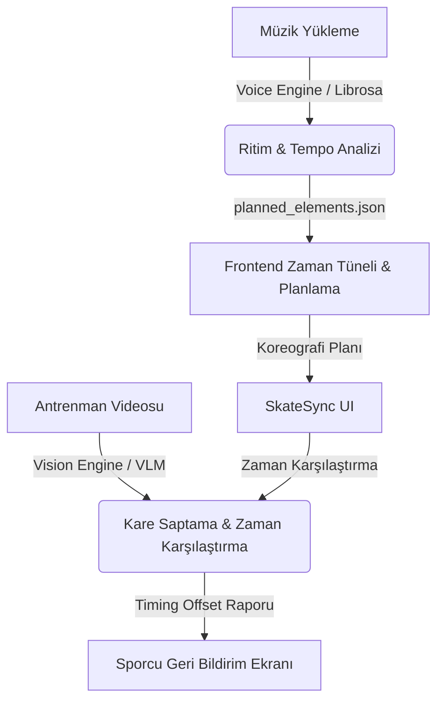

# SkateSync AI - Workspace Monorepo

Bu depo, **SkateSync AI** projesinin tüm ön uç (React/Vite/Tailwind) ve yapay zeka/arka uç (Python Vision & Voice Engines) modüllerini temiz, modüler ve ölçeklenebilir bir monorepo yapısında bir araya getirir.

---

## 📂 Monorepo Yapısı

Sürdürülebilirlik ve bağımsız ölçeklenebilirlik kuralları gereği, proje endüstri standartlarında bir monorepo düzenine ayrılmıştır:

```text
metu-sports-hackhaton/
├── frontend/               # React + Vite + Tailwind CSS Uygulaması
│   ├── src/                # Arayüz kodları, App.jsx, firebase vb.
│   ├── public/             # Statik varlıklar (resim, ses, video)
│   ├── knowledge/          # Figür pateni hareket katalogları ve JSON verileri
│   ├── package.json        # Ön uç bağımlılıkları ve betikleri
│   └── vite.config.js      # Vite yapılandırması
│
├── backend/                # Yapay Zeka & Analiz Motorları (Python 3.10+)
│   ├── vision/             # VLM timing ve video analiz motoru (vlm_review.py vb.)
│   └── voice/              # Librosa ritim analizi ve ses koçluk motoru (audio_analyzer.py vb.)
│
├── docs/                   # Genel sistem mimarisi, tasarım ve akış şemaları (Workflows)
│   ├── CONTEXT.md          # Proje bağlamı ve genel vizyon
│   ├── DESIGN.md           # Sistem tasarımı ve mimari kararlar
│   └── workflows/          # SVG Akış şemaları ve sekans diyagramları
│
├── .gitignore              # Global git yoksayma dosyası
├── netlify.toml            # Ön uç otomatik dağıtım (deploy) yapılandırması
└── README.md               # Bu belge (Ana çalışma alanı açıklaması)
```

---

## 🚀 Başlangıç & Kurulum Kılavuzu

### 🖥️ 1. Ön Yüz (Frontend) Kurulumu ve Çalıştırma

Ön yüz uygulaması **React**, **Vite** ve **TailwindCSS** ile geliştirilmiştir.

1.  **Ön Yüz Dizinine Geçin:**
    ```bash
    cd frontend
    ```
2.  **Bağımlılıkları Yükleyin:**
    ```bash
    npm install
    ```
3.  **Geliştirme Sunucusunu Başlatın:**
    ```bash
    npm run dev
    ```
    *Uygulama yerel olarak `http://localhost:5173` adresinde çalışacaktır.*

---

### 🐍 2. Yapay Zeka Motorları (Backend) Kurulumu

Yapay zeka motorları, ritim analizini (`librosa` tabanlı) ve sporcu videolarını planlanan zamanlamalarla karşılaştıran VLM (`vision` motoru) süreçlerini yürütür.

1.  **Arka Uç Dizinine Geçin ve Sanal Ortam Oluşturun:**
    ```bash
    cd backend
    python -m venv .venv
    source .venv/bin/activate  # Windows için: .venv\Scripts\Activate.ps1
    ```
2.  **Modern PEP 621 Yöntemi ile Bağımlılıkları Yükleyin:**
    ```bash
    pip install -e .
    ```
3.  **Motorları CLI Üzerinden Çalıştırın:**
    *   **Ses & Ritim Analiz Motoru (Voice Engine):**
        ```bash
        python -m voice --help
        ```
    *   **Görüntü & VLM Analiz Motoru (Vision Engine):**
        ```bash
        python -m vision --help
        ```

---

### 🔄 3. Full-Stack Entegre Akış Kurulumu

SkateSync AI, müzik ritim analizi ile koreografi planlamasını ve ardından video karşılaştırmayı bir zincir halinde yürütür. Tam entegre bir geliştirme veya test akışı için aşağıdaki adımları sırasıyla izleyin:

1.  **Müzik Analizi (Ses Motoru):**
    Sporcu müziği yüklendiğinde, ses motoru tempoları (BPM) ve ritimleri analiz ederek koreografi planlama için gerekli olan zaman aralıklarını (`planned_elements.json`) çıkartır:
    ```bash
    # backend/ dizinindeyken:
    python -m voice analyze --file input.mp3 --output planned_elements.json
    ```
2.  **Koreografi Planlama (Ön Yüz):**
    Oluşan `planned_elements.json` verisi veya ön yüzdeki müzik zaman tüneli aracılığıyla sporcu/antrenör teknik hareketleri (Jump, Spin vb.) zaman tüneline yerleştirir. Ön yüz geliştirme sunucusu aktifken arayüzden bunu görsel olarak yönetebilirsiniz:
    ```bash
    # frontend/ dizinindeyken:
    npm run dev
    ```
3.  **Performans & Video Değerlendirme (Görüntü Motoru):**
    Sporcu antrenman videosunu yüklediğinde, görüntü motoru planlanan zaman pencerelerine denk gelen kareleri VLM ile analiz ederek timing sapmalarını (offset farklarını) ve teknik puanları raporlar:
    ```bash
    # backend/ dizinindeyken:
    python -m vision review --video performance.mp4 --plan planned_elements.json
    ```

---

## 📊 Entegre Veri Akış Modeli


