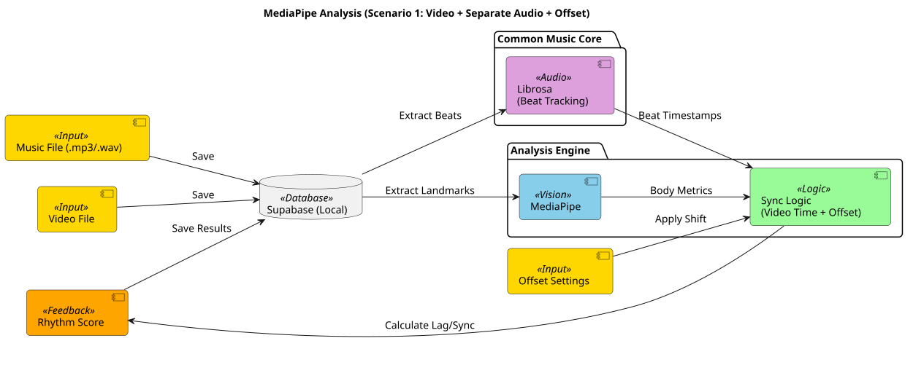
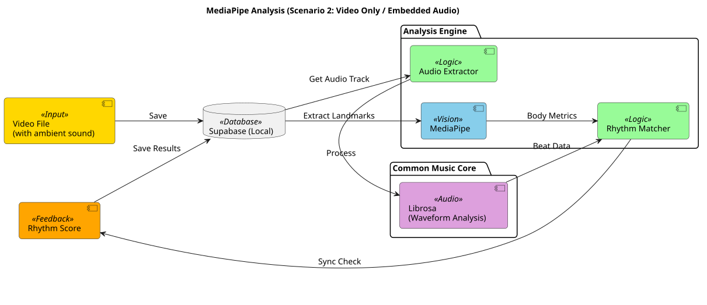
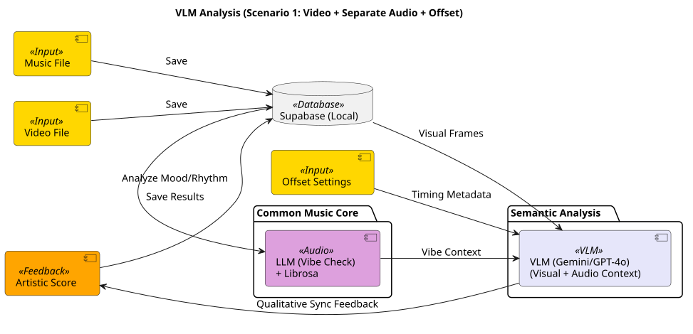
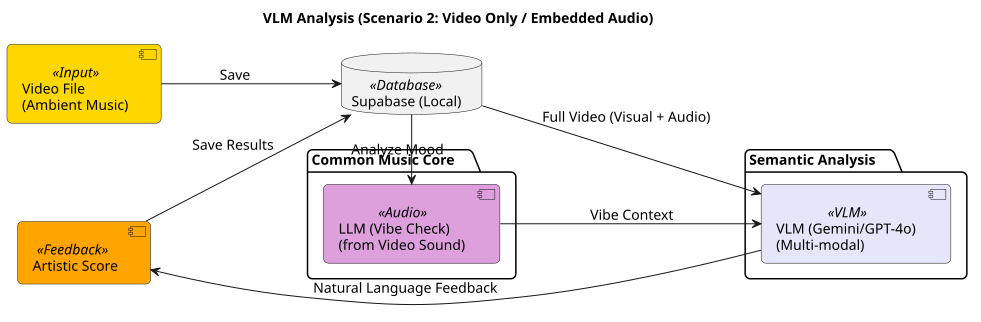
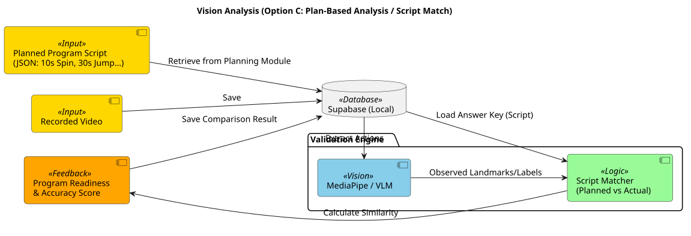
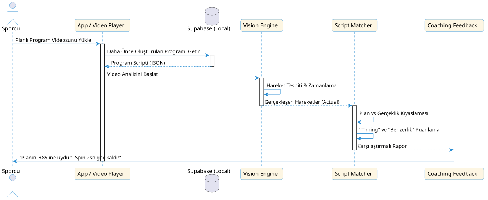

# 👁️ Vision (Görüntü İşleme) Stratejisi

Bu katman, SkateSync AI'ın "Gözü"dür. Ancak bu göz sadece bakmaz; aynı zamanda müziği "duyar" ve **sporcunun hareketlerinin müziğin ritmiyle ne kadar uyumlu olduğunu** analiz eder.

> [!IMPORTANT]
> **Ortak Müzik Motoru (Common Music Core):** Vision modülü, ritim ve duygu analizi için [VOICE.md](file:///home/neo/Downloads/METU%20SPORTS%20HACKHATON/metu-sports-hackhaton/VOICE.md) dosyasında detaylandırılan **Librosa + LLM** hibrit altyapısını ortak bir servis olarak kullanır. Bu sayede müzik ve video analizi %100 aynı referans noktaları üzerinden gerçekleştirilir.

## 🧒 Vision Süreci: 6 Yaşındaki Çocuk Versiyonu

Sistemimiz sporcuyu izleyen sihirli bir göz gibi çalışır:

1.  **Ritim Dedektifi:** Sistem aynı zamanda çalan müziği de dinler. Sen tam davul vurduğunda mı zıpladın? Yoksa geç mi kaldın? Sistem bunu hemen anlar.
2.  **Nokta Birleştirme (Classic):** Vücuduna görünmez noktalar koyar. "Müzik hızlandığında sen de hızlandın mı?" diye kontrol eder.
3.  **Akıllı Yorumcu (VLM):** Hareketlerine bakıp "Müziğin ruhuna ne kadar da yakışmışsın!" gibi moral verici yorumlar yapar.

---

## 🟢 Seçenek A: Landmark Tabanlı Analiz (MediaPipe)

Bu senaryoda analiz tamamen **zamanlama ve koordinat** üzerinedir.

### Senaryo 1: Video + Ayrı Müzik Dosyası + Offset (Pro Mod)
Sporcu, yüksek kaliteli müzik dosyasını video dosyasından bağımsız olarak yükler. Sistem, **müzik ses dosyasının videonun tam olarak kaçıncı saniyesinde (offset) çalmaya başlaması gerektiğini** kullanıcı ayarı olarak alır ve analizini bu zaman kaymasına göre milisaniyelik doğrulukla yapar.

*   **Avantaj:** En yüksek ses kalitesi ve milisaniyelik doğruluk.
*   **Süreç:** Müzik dosyası referans alınır, videodaki hareketler belirtilen "offset" değerine göre kaydırılarak senkronize edilir.

### Senaryo 2: Sadece Video (Gömülü Ses Analizi)
Sporcu sadece video yükler, sistem videonun içindeki sesi ayıklar.

*   **Avantaj:** Hızlı kullanım, ek dosya gerektirmez.
*   **Süreç:** Videodaki ses dalgaları (waveform) analiz edilerek ritim vuruşları (beats) otomatik tespit edilir.

---

## 🟣 Seçenek B: VLM Tabanlı Analiz (Gemini / GPT-4o)

Bu senaryoda analiz **estetik ve karakter** üzerinedir.

### Senaryo 1: Video + Ayrı Müzik + Offset (Derin Analiz)
VLM'e video karelerinin yanı sıra, müziğin karakteri ve **müziğin videonun kaçıncı saniyesinde devreye girmesi gerektiği (sync offset)** bilgisi birer bağlamsal veri (context) olarak iletilir.

*   **Avantaj:** Müziğin teknik yapısıyla hareketin sanatsal uyumu sorgulanabilir.
*   **Süreç:** "Müzik bu saniyede çok dramatikleşiyor, sporcu o an doğru duyguyu yansıtıyor mu?" analizi yapılır.

### Senaryo 2: Sadece Video (Multimodal Analiz)
VLM, videoyu hem görür hem duyar (full multimodal).

*   **Avantaj:** En doğal ve insansı yorumlama.
*   **Süreç:** Model videoyu bir bütün olarak izler ve "Duyduğum müzik ile gördüğüm hareketler birbiriyle dans ediyor" gibi sonuçlar üretir.

---

## 🟠 Seçenek C: Planlı Program Analizi (C Planı - Script Match)

Bu senaryo, projenin [CONTEXT.md](file:///home/neo/Downloads/METU%20SPORTS%20HACKHATON/metu-sports-hackhaton/CONTEXT.md) dosyasında belirtilen **Program Planlama** modülünden gelen "Hareket Listesi" (Script) üzerinden yapılan analizdir. "Cevap Anahtarı" belli olduğu için en hızlı ve karşılaştırmalı sonuç veren yöntemdir.

### 1. İş Akışı (Workflow)

### 2. Teknik Süreç (Sequence Diagram)

### Temel Özellikler:
*   **Hazır Liste Kıyaslaması:** Sistem, "10. saniyede Spin yapmalısın" bilgisini bilir. Videoda o saniyede ne yapıldığını MediaPipe veya VLM ile kontrol eder.
*   **Benzerlik Skoru:** Sporcunun plana ne kadar sadık kaldığını (Readiness Score) ölçer.
*   **Hata Tespiti:** "Plana göre burada Jump vardı ama sen Step yaptın" gibi doğrudan karşılaştırmalı geri bildirim verir.

---

## ❓ VLM Varken MediaPipe Gerekli mi?

**Ritim analizi için EVET.**
Çünkü müziğin vuruşuyla hareketin vuruşunu milisaniye bazında yakalamak için MediaPipe'ın sağladığı sayısal veri hızı kritik önemdedir. VLM bu konuda henüz MediaPipe kadar "milisaniyelik" hassasiyet sunamaz.

---

## 3. Video ve Müzik Senkronizasyonu (Digital Timestamping)

Videonun 0. milisaniyesi ile dijital müzik dosyasının 0. milisaniyesi birbirine kilitlenir. Bu sayede sporcu kulaklık taksa bile, sistem videodaki görüntünün müzikteki hangi notaya denk geldiğini %100 doğrulukla bilir.
