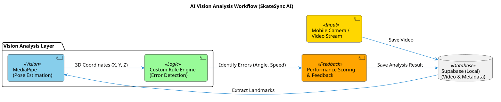
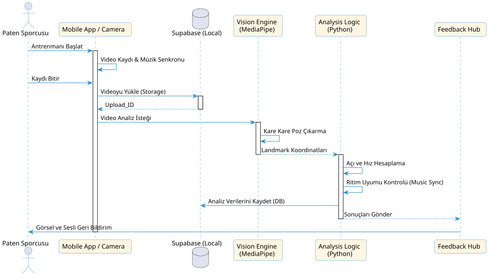

# 👁️ Vision (Görüntü İşleme) Stratejisi

Bu doküman, SkateSync AI projesinin görüntü işleme katmanını, vücut analiz mantığını ve video-müzik senkronizasyon stratejisini detaylandırır.

---

## 👁️ Süreç Nasıl İşliyor? (Basitçe Anlatım)

Sistemimiz sporcunun her hareketini milimetrik olarak takip eden dijital bir göz gibi çalışır:

1.  **Görmek:** Telefonun kamerası sporcuyu kaydederken, **MediaPipe** teknolojisi sporcunun eklemlerini (omuz, diz, ayak bileği vb.) gerçek zamanlı olarak işaretler.
2.  **Analiz Etmek:** Sistem, bu işaretlerin arasındaki açıları ve hareket hızını ölçer. Örneğin; bir sıçrama anında dizin ne kadar kırıldığını veya havada kaç derece dönüldüğünü matematiksel olarak hesaplar.
3.  **Hataları Yakalamak:** Elde edilen veriler, "mükemmel form" verileriyle karşılaştırılır. Eğer sporcu dengesini kaybediyorsa veya ritimden kopuyorsa sistem bunu anında tespit eder.
4.  **Raporlamak:** Tüm bu görsel analiz sonuçları, kullanıcının gelişimini takip edebilmesi için **Supabase** veri tabanına kaydedilir.

---

## 1. İş Akışı (Workflow)

### Kullanılan Araçlar:
*   **MediaPipe:** Vücut landmark'larını (33 adet eklem noktası) 3D koordinat olarak çıkaran motor.
*   **Custom Rule Engine (Python):** Landmark verilerini kullanarak "Açı", "Denge" ve "Hız" gibi spor odaklı metrikleri hesaplayan mantık katmanı.
*   **Supabase (Local):** Ham videoların ve analiz edilmiş metadata sonuçlarının saklandığı merkez.

---

## 2. Teknik Süreç (Sequence Diagram)

---

## 3. Video ve Müzik Senkronizasyonu (Önemli Detaylar)

Paten gibi ritim odaklı sporlarda video ve müzik arasındaki uyum kritiktir. Karşılaşılan teknik zorluklar ve çözümlerimiz:

### Video Kaydı Sırasında Müzik Sesi Ne Oluyor?
*   **Sorun:** Çoğu telefon video kaydına başladığında mikrofonu kullandığı için sistem sesini (müziği) dışarı vermeyi durdurur veya kısar.
*   **Çözüm:** Uygulamamız, müziği video kaydıyla **eş zamanlı olarak dijital bir timestamp (zaman damgası)** ile başlatır. Videonun 0. saniyesi, müziğin 0. saniyesine kilitlenir. Videonun içindeki sesin (ortam gürültüsü) kalitesi analizi etkilemez çünkü biz dijital müzik dosyasını referans alırız.

### Sporcunun Kulağında Müzik Varken Ne Oluyor?
*   **Senaryo:** Sporcu kulaklıkla kendi müziğini dinleyerek kayıyor.
*   **Teknik Yaklaşım:** Uygulama, sporcunun kulağına giden müzikle kameranın kaydettiği görüntüyü "Master Sync" sinyaliyle birleştirir. Sporcu kulaklığında müziğin vuruşunu (beat) duyduğu anda, AI sistemi de o anın müzikteki hangi milisaniyeye denk geldiğini bildiği için **"Müzik-Hareket Uyumu" (Rhythm Consistency)** puanlamasını tam doğrulukla yapar.

---

## 4. Stratejik Notlar

*   **Düşük Gecikme:** Analizler kare bazlı (frame-by-frame) yapıldığı için sporcu antrenmanı bitirdiği anda raporu hazır olur.
*   **Işık ve Arka Plan:** MediaPipe kullanımı sayesinde, çok karmaşık olmayan arka planlarda ve standart buz pisti ışıklandırmasında yüksek doğruluk sağlanır.
*   **Gizlilik:** Görüntüler sadece analiz amaçlı kullanılır ve yerel (local) Supabase üzerinde saklanarak veri güvenliği en üst düzeyde tutulur.
