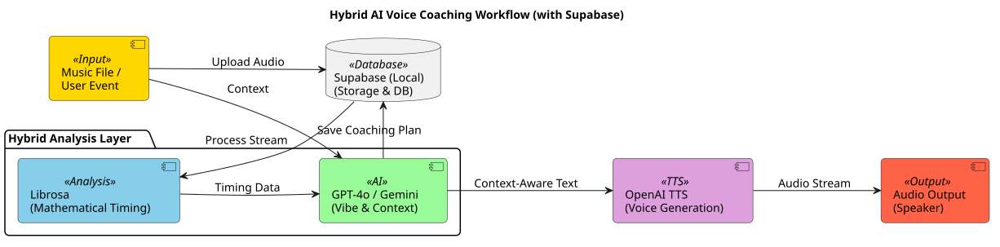
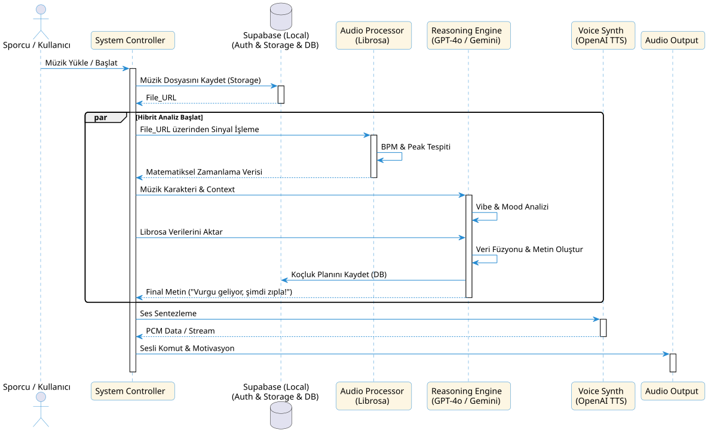

# SkateSync AI Voice Architecture

Bu doküman, SkateSync AI içindeki sesli koçluk hattının güncel halini ve mimari yapısını açıklar.

## Güncel Hedef

Sesli tarafın amacı:
- Müzikten `planned_elements` üretmek (Choreography Planning)
- Her plan hareketi için bir koçluk sesli uyarısı (`coaching cue`) üretmek
- İstenirse bu cue'ları OpenAI TTS ile seslendirmek
- Üretilen sesleri arka plan müziğiyle otomatik mikslemek

## Katmanlar ve İşleyiş

1. **Müziği Hafızaya Alma:** Sporcu müziğini yüklediğinde, sistem bunu güvenli bir şekilde depolama alanına kaydeder.
2. **Ritmi ve Ruhu Anlama:** 
   * **Librosa** (matematiksel analiz) müziğin içindeki vuruşları, saniyenin binde biri hassasiyetinde ölçer ("Tık tık" ritmi nerede?).
   * **GPT-4o / Gemini** (zekâ katmanı) müziği "dinler", temposunu (BPM) ve havasını çıkarır.
3. **Kişisel Koçluk Planı:** Sistem, ritim noktalarıyla müziğin havasını birleştirir. Sadece "Zıpla" demek yerine, *"Müzik burada yükseliyor, tam bu ritimle beraber zıpla!"* gibi doğal ve motive edici cümleler hazırlar.
4. **Sesli Geri Bildirim:** Hazırlanan bu cümleler, **OpenAI TTS** ile gerçek bir insan sesi kalitesinde seslendirilir ve sporcuya tam vaktinde iletilir.
5. **Görsel Özet ve Metin Raporu:** Sesli komutların tamamı, antrenman sonunda bir **"Koçluk Özeti"** olarak ekranda listelenir. Böylece sporcu duyduğu tavsiyeleri daha sonra yazılı olarak da inceleyebilir.



### Katmanlar ve Araçlar:
* **Veri Katmanı:** Müzik dosyalarının saklandığı ve koçluk planlarının/analiz verilerinin tutulduğu merkezdir.
* **Analiz Katmanı (Librosa):** Müziğin BPM ve ritim noktalarını matematiksel olarak analiz eder.
* **Zekâ Katmanı (GPT-4o / Gemini):** Teknik verileri, müziğin atmosferiyle birleştirerek kişiselleştirilmiş koçluk metni üretir.
* **Sentez Katmanı (OpenAI TTS):** Metni doğal bir insan sesine dönüştürür.
* **Görsel Katman (Coaching Dashboard):** Üretilen koçluk metinlerini ve analiz sonuçlarını sporcuya yazılı bir rapor olarak sunar.
* **İletim Katmanı (Web Audio API):** Sesi tarayıcıda gecikmesiz olarak çalar.

---

## Güncel Davranış

Voice hattında artık iki farklı karar katmanı var:

### 1. Planner
- OpenAI/Gemini kullanır
- Müzik analizinden hareket listesi üretir
- Sadece izin verilen hareket adlarını kullanır
- Hareketleri tüm parçaya yaymaya çalışır

### 2. Coaching Engine
- Artık serbest LLM cümlesi yazdırmıyor
- Deterministic hareket callout'ları üretir
- `plan.json` içindeki her hareket için en az bir cue verir
- Özellikle jump'larda sayımlı giriş kullanır

Örnek cue'lar:
- `Bir iki üç, aksel`
- `Camel spin, hattı uzat`
- `Spiral, çizgiyi uzat`
- `One foot glide, dengeyi koru`

Uzun spinlerde ek sayım cue'su da gelebilir:
- `Bir iki üç, sit spin`



---

## Ana Dosyalar

Kod `src/voice` altında konumlanmıştır:
- `src/voice/audio_analyzer.py`
- `src/voice/program_planner.py`
- `src/voice/coaching_engine.py`
- `src/voice/tts_engine.py`
- `src/voice/main.py`
- `src/voice/cli.py`

Bilgi tabanı:
- `src/voice/knowledge/figure_skating_knowledge.json`
- `src/voice/knowledge/skating-movement-catalog.md`

## Girdi Şeması

```json
{
  "planned_elements": [
    {
      "name": "Camel Spin",
      "type": "spin",
      "start_time": 31.0,
      "end_time": 36.5,
      "music_peak_time": 34.0
    }
  ]
}
```

## Çıktı Dosyaları

Her run sonunda şu dosyalar oluşabilir:
- `audio_analysis.json`
- `planned_elements.json`
- `coaching_cues.json`
- `coaching_cues.txt`
- Opsiyonel olarak `cue_audio_files.json`
- Opsiyonel olarak `coaching_mix.mp3`

## Varsayılan Output Davranışı

`--output-dir` verilmezse output otomatik olarak şu klasöre gider:
- `data/runtime/voice/<session_id>/`

## Hızlı Test

### Planner + Cue Üretimi
```bash
python -m src.voice "C:\path\to\music.mp3"
```

### Hazır Planla Cue Üretimi
```bash
python -m src.voice "C:\path\to\music.mp3" --plan "path\to\planned_elements.json"
```

### TTS
```bash
python -m src.voice "C:\path\to\music.mp3" --plan "path\to\planned_elements.json" --include-tts
```

### TTS + Mix
```bash
python -m src.voice "C:\path\to\music.mp3" --plan "path\to\planned_elements.json" --include-tts --mix-audio
```

## Frontend İçin Kritik Notlar
- Frontend `planned_elements.json` ve `coaching_cues.json` dosyalarına bağlanmalı
- Frontend cue preview ekranında `text`, `time`, `element_name`, `cue_kind` gösterebilir
- TTS varsa `coaching_mix.mp3` doğrudan oynatılabilir
- Coach artık bazı hareketleri atlamaz; plan içindeki tüm hareketleri okur
