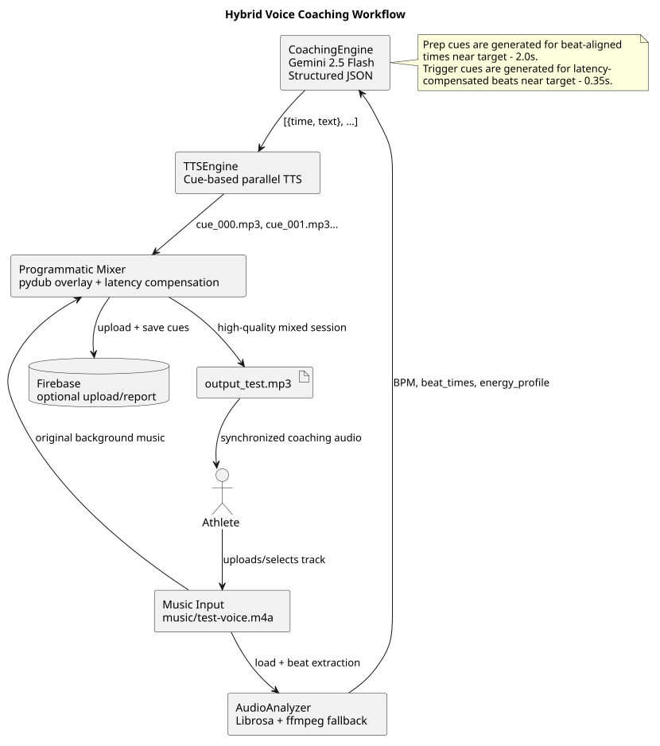
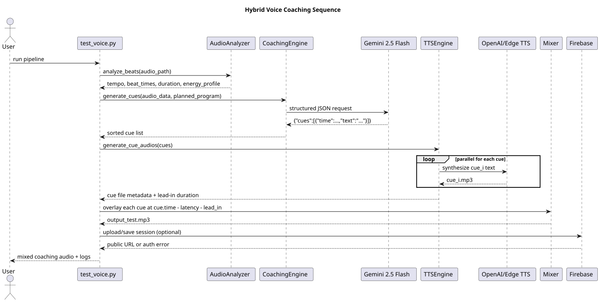

# VOICE LAST

Bu sürümde sesli koçluk hattı, `VOICE.md` içindeki hibrit stratejiye sadık kalacak şekilde yeniden kurulmuştur.

## Ne değişti?

* `src/voice/program_planner.py` (YENİ)
  Müziğin süresi ve enerji profili (Librosa çıktısı) kullanılarak Gemini 2.5 Flash ile yarışma standartlarına uygun 10-15 hareketlik otonom bir koreografi üretimi (Program Planner) eklendi.
  (Testlerdeki 3 manuel hareketlik dummy_program kaldırıldı.)

* `src/voice/coaching_engine.py`
  **Zorunlu "Snap to Beat" / Mıknatıs Katmanı:** LLM metin üretmeden hemen önce devreye giren bir matematik katmanı eklendi. LLM'in hedef hareket süreleri (`target_time`), Librosa'nın çıkardığı küsuratlı ritim vuruşlarına (`beat_times`) zorla yapıştırılarak tam senkronizasyon sağlandı.
  Büyük JSON çıktıları için token limiti artırıldı (`max_output_tokens=4096`) ve hatalara karşı 3 aşamalı Retry/Cleanup döngüsü eklendi.
  Ayrıca hazırlık cue'ları için yaklaşık `target - 2.0s`, tetikleyici cue'lar için yaklaşık `target - 0.35s` latency telafili beat noktaları hesaplanıyor.

* `src/voice/tts_engine.py`
  Tek parça metin yerine her cue için ayrı ses klibi üretiyor.
  Klipler paralel olarak oluşturuluyor.
  Her klip için `lead_in_ms` ve `duration_ms` ölçülerek miksaj katmanına aktarılıyor.

* `src/voice/main.py`
  `full_text = " ".join(...)` yaklaşımı tamamen kaldırıldı.
  Orijinal müzik ile cue klipleri `pydub.AudioSegment.overlay()` kullanılarak milisaniye bazında karıştırılıyor.
  Miks konumu şu mantıkla belirleniyor:
  `cue_time_ms - lead_in_ms - playback_latency_ms`

* `src/voice/audio_analyzer.py`
  Analiz çıktısına `energy_profile` eklendi.
  `m4a` uyumsuzlukları için ffmpeg tabanlı WAV fallback korundu.

* `src/voice/test_voice.py`
  Dinamik program üretip hibrit hattı uçtan uca çalıştırıyor.
  Terminalde Gemini cue JSON'unu, miks loglarını ve çıktı doğrulamasını gösteriyor.

## Doğrulanan davranış

`python src/voice/test_voice.py` çalıştırıldığında:

* `ProgramPlanner` müziğin enerjisine göre tüm parçaya dağılmış **17 farklı hareket** belirledi.
* "Snap to beat" çalışarak hareketleri tam Librosa vuruşlarına mıknatısladı.
* Her hareket için hazırlık ve tetikleyici dahil toplam **34 cue (ses klibi)** oluşturuldu.
* Miksaj loglarında milisaniye seviyesinde (örn: `166.255s`) overlay pozisyonları görüldü.
* `src/voice/output_test.mp3` başarıyla üretildi.
* Çıktı süresi giriş müziğiyle eşleşti (`169.5s`).

## Diyagramlar

### Hybrid Voice Coaching Workflow

* Kaynak: [workflows/voice_hybrid_workflow.puml](workflows/voice_hybrid_workflow.puml)

### Hybrid Voice Coaching Sequence

* Kaynak: [workflows/voice_hybrid_sequence.puml](workflows/voice_hybrid_sequence.puml)
